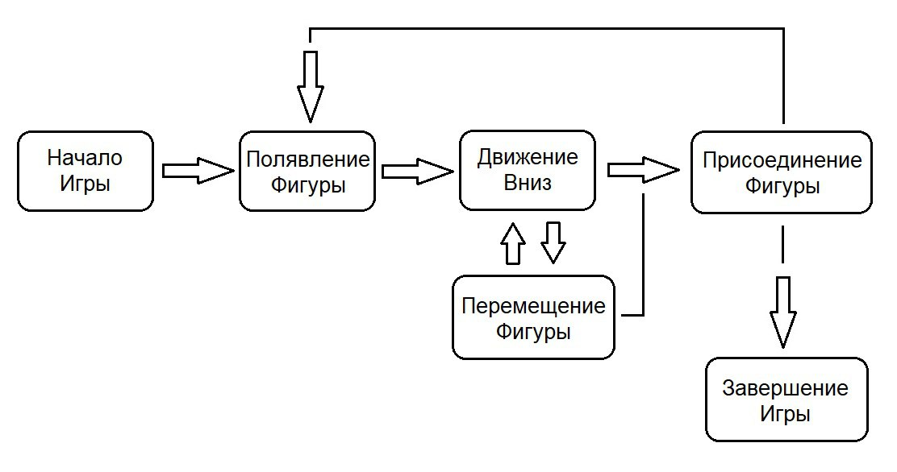
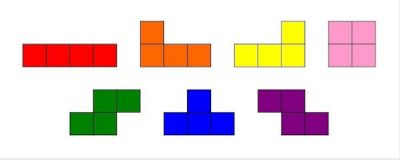
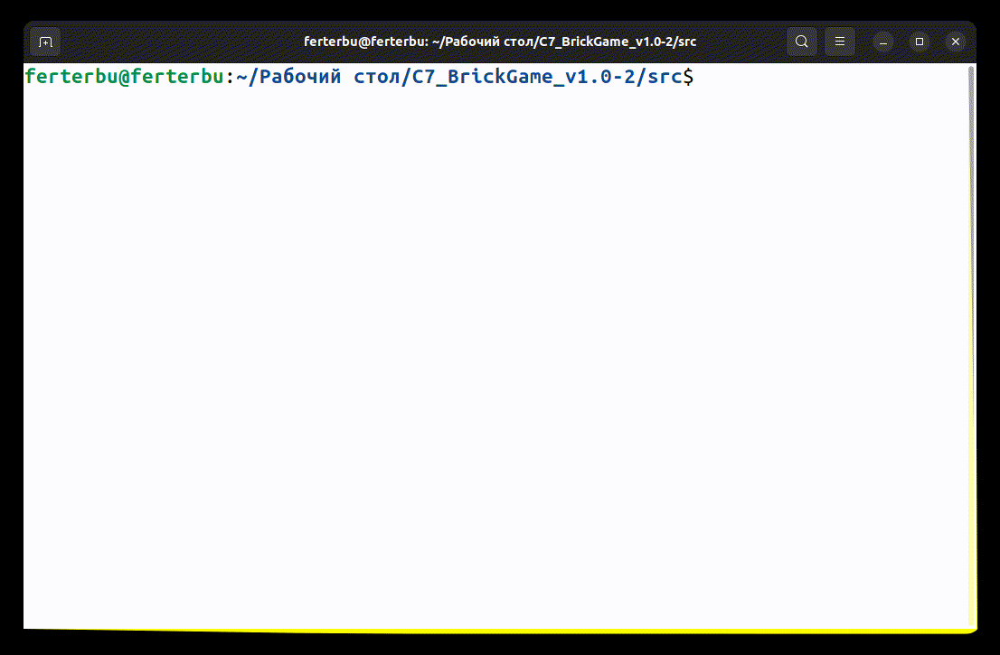
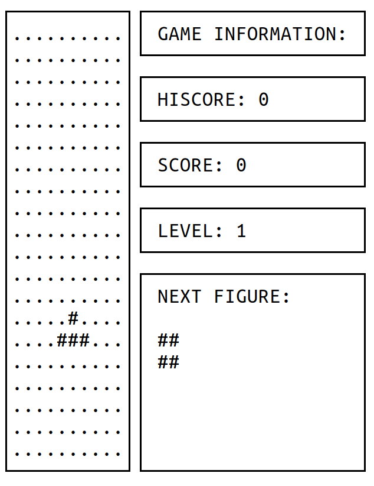

# BrickGame Tetris
В данном проекте предстояло реализовать игру «Тетрис» на языке программирования С с использованием структурного подхода, а именно, проект должен состоять из двух частей: библиотеки, реализующей логику работы игры, которую можно подключать к различным GUI в будущем, и терминального интерфейса, разработанного с использованием библиотеки `ncurses`. Логика работы библиотеки должна быть реализована с использованием конечных автоматов, одно из возможных описаний которого будет дано ниже.

## Для формализации логики данной игры можно представить следующий вариант конечного автомата:  

Данный КА состоит из следующих состояний:

- Старт — состояние, в котором игра ждет, пока игрок нажмет кнопку готовности к игре.
- Спавн — состояние, в которое переходит игра при создании очередного блока и выбора следующего блока для спавна.
- Перемещение — основное игровое состояние с обработкой ввода от пользователя — поворот блоков/перемещение блоков по горизонтали.
- Сдвиг — состояние, в которое переходит игра после истечения таймера. В нем текущий блок перемещается вниз на один уровень.
- Соединение — состояние, в которое преходит игра после «соприкосновения» текущего блока с уже упавшими или с землей. Если образуются заполненные линии, то она уничтожается и остальные блоки смещаются вниз. Если блок остановился в самом верхнем ряду, то игра переходит в состояние «игра окончена».
- Игра окончена — игра окончена.

## Требования к проекту

- Программа должна быть разработана на языке Си стандарта C11 с использованием компилятора gcc.
- Программа должна состоять из двух частей: библиотеки, реализующей логику игры тетрис, и терминального интерфейса с использованием библиотеки `ncurses`.
- Для формализации логики игры должен быть использован конечный автомат.
- Библиотека должна иметь функцию, принимающая на вход ввод пользователя, и функцию, выдающую матрицу, которая описывает текущее состояние игрового поля, при каждом ее изменении.
- Код библиотеки программы должен находиться в папке `src/brick_game/tetris`.
- Код с интерфейсом программы должен находиться в папке `src/gui/cli`.
- Сборка программы должна быть настроена с помощью Makefile со стандартным набором целей для GNU-программ: all, install, uninstall, clean, dvi, dist, test, gcov_report. Установка должна вестись в любой другой произвольный каталог.
- Программа должна быть разработана в соответствии с принципами структурного программирования.
- При написании кода придерживайся Google Style.
- Должно быть обеспечено покрытие библиотеки unit-тестами, с помощью библиотеки `check` (тесты должны проходить на ОС Darwin/Ubuntu). Покрытие библиотеки с логикой игры тестами должно составлять не меньше 80 процентов.
- В игре должны присутствовать следующие механики:
  - Вращение фигур;
  - Перемещение фигуры по горизонтали;
  - Ускорение падения фигуры (при нажатии кнопки фигура перемещается до конца вниз);
  - Показ следующей фигуры;
  - Уничтожение заполненных линий;
  - Завершение игры при достижении верхней границы игрового поля;
  - В игре должны присутствовать все виды фигур, показанных на картинке ниже.
- Для управления добавь поддержку всех кнопок, предусмотренных на физической консоли:
  - Начало игры,
  - Пауза,
  - Завершение игры,
  - Стрелка влево — движение фигуры влево,
  - Стрелка вправо — движение фигуры вправо,
  - Стрелка вниз — падение фигуры,
  - Стрелка вверх — ни используется в данной игре,
  - Действие (вращение фигуры).
- Игровое поле должно соответствовать размерам игрового поля консоли — десять «пикселей» в ширину и двадцать «пикселей» в высоту.
- Фигура, после достижения нижней границы поля или соприкосновения с другой фигурой, должна остановиться. После этого происходит генерация следующей фигуры, показанной на превью.
- Интерфейс библиотеки должен соответствовать описанию, которое находится в materials/library-specification.md.
- Пользовательский интерфейс должен поддерживать отрисовку игрового поля и дополнительной информации.
- Подготовь в любом формате диаграмму, описывающую используемый КА (его состояния и все возможные переходы).

## Используемые фигуры:

### Часть 2. Дополнительно. Подсчет очков и рекорд в игре

Добавь в игру следующие механики:

- подсчет очков;
- хранение максимального количества очков.

Данная информация должна передаваться и выводиться пользовательским интерфейсом в боковой панели. Максимальное количество очков должно храниться в файле или встраиваемой СУБД и сохраняться между запусками программы.

Максимальное количество очков должно изменяться во время игры, если пользователь во время игры превышает текущий показатель максимального количества набранных очков.

Начисление очков будет происходить следующим образом:

- 1 линия — 100 очков;
- 2 линии — 300 очков;
- 3 линии — 700 очков;
- 4 линии — 1500 очков.

### Часть 3. Дополнительно. Механика уровней

Добавь в игру механику уровней. Каждый раз, когда игрок набирает 600 очков, уровень увеличивается на 1. Повышение уровня увеличивает скорость движения фигур. Максимальное количество уровней — 10.

## Установка:
Установка игры происходит при помощи команды `make install`
- Файл `game` - Игра
- Файл `test` - Unit-тесты

## Функции:

Классический геймплей тетрис состоитиз следующих механик:
- Вращение фигур
- Горизонтальное движение фигур
- Падение фигуры вниз поля (при нажитии клавиши со стрелкой вниз)
- Отображение следующей фигуры
- Очистка линии
- Игра окончена, когда фигура достигнет вершины игрового поля

## Управление:

Поддержка всех физических кнопок консоли:
- Пауза – W || w
- Выключить паузу – E || e
- Конец игры – Q || q
- Стрелка влево — переместить фигуру влево
- Стрелка вправо — переместить фигуру вправо
- Стрелка вниз – переместить фигуру вниз
- Стрелка вверх – вращение фигуры

## Визуальная составляющая:
Интерфейс игры представляет из себя матрицу размером 10х20 пикселей с дополнительными окнами:

- Окно `HISCORE` - Отображение рекордного кол-ва отчков игрока
- Окно `SCORE` - Отображение текущего кол-ва очков игрока 
- Окно `LEVEL` - Отображение текущего уровня игрока
- Окно `NEXT FIGURE` - Отображение следующей фигуры

## Дополнительная механика подсчета очков:

- Очищена 1 линия: 100 очков
- Очищены 2 линии: 300 очков
- Очищено 3 линии: 700 очков
- Очищено 4 линии: 1500 очков
- Отображение текущего результата игрока и наивысшего достигнутого результата
- Наивысший результат хранится в файле `high_score.txt`, и сохраняется между игровыми сессиями

## Дополнительная механика уровней:

При достижении игроком определенного кол-ва очков предусмотрена механика уровней. Повышение уровня происходит при достижении каждых 600 очков. Повышение уровня увеличивает скорость падения фигур.

- При достижении 600 очков: `Level` - 2, `Game Speed` - 0.45 сек.
- При достижении 1200 очков: `Level` - 3, `Game Speed` - 0.40 сек.
- При достижении 1800 очков: `Level` - 4, `Game Speed` - 0.35 сек.
- При достижении 2400 очков: `Level` - 5, `Game Speed` - 0.30 сек.
- При достижении 3000 очков: `Level` - 6, `Game Speed` - 0.25 сек.
- При достижении 3600 очков: `Level` - 7, `Game Speed` - 0.20 сек.
- При достижении 4200 очков: `Level` - 8, `Game Speed` - 0.15 сек.
- При достижении 4800 очков: `Level` - 9, `Game Speed` - 0.10 сек.
- При достижении 5600 очков: `Level` - 10, `Game Speed` - 0.05 сек.